DEVOPS TOOLING WEBSITE SOLUTION

As a member of a DevOps team, you will implement a tooling website solution which makes access to DevOps tools within the corporate infrastructure easily accessible. 

In this project, you will implement a solution that consistd of the following components:

`Infrastructure`: AWS

`Webserver Linux`: RED Hat Enterprise linux 8

`Database Server`: Ubuntu 20.04 + MySQL

`Storage Server`: Red Hat Enterprise LInux 8 + NFS Server

`Programming Language`: PHP

`Code Repository`: GitHub

`STEP 1`- PREPARE NFS SERVER

`1` Spin up an EC2 instance and based on your experience from the Project9,configure LVM on the server

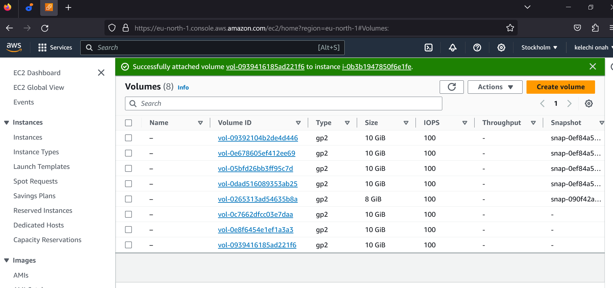

Create partition

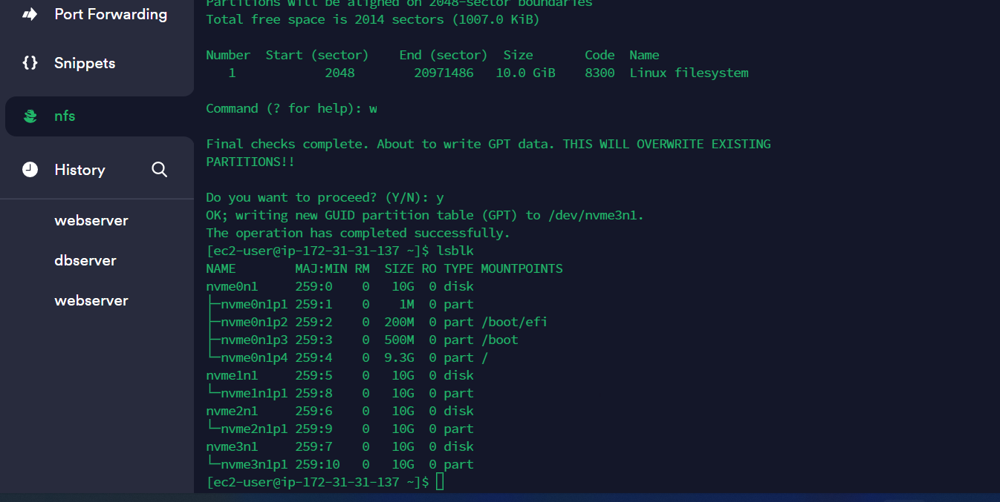

Install LVM

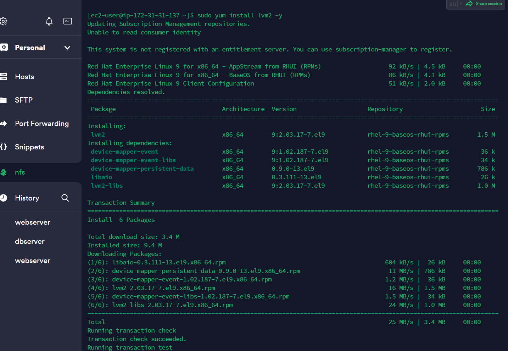

Check your setup

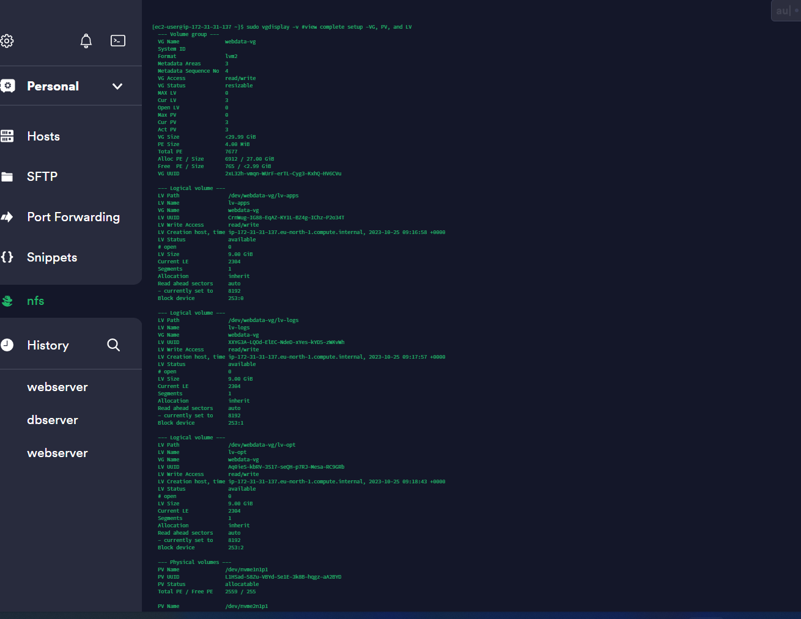

Instead of formatting the disks as `ext4` you will have them formated as `xfs` Ensure there are 3 logical Volumes `lv-opt` `lv-apps` `lv-logs`

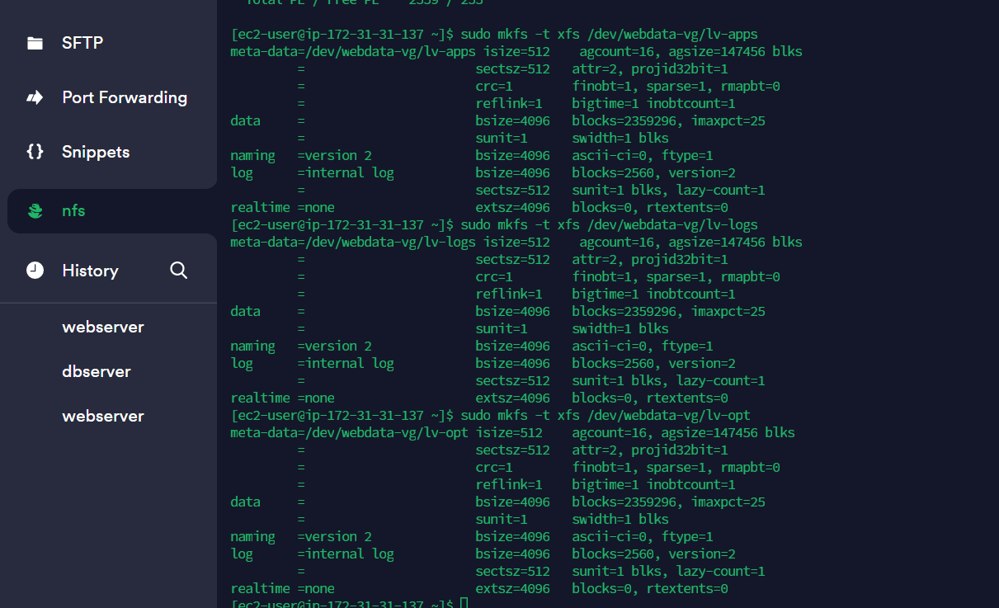

Create mount points on `/mnt` directory for the logical volumes. Mount `lv-apps` on `/mnt/apps` Mount `lv-logs` on `/mnt/logs` Mount `lv-opt` on `/mnt/opt`

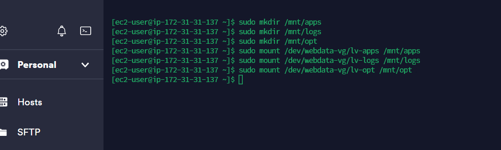

Install NFS server, configure it to start on reboot and make sure it is up and running. use the commands below

`sudo yum -y update`

`sudo yum install nfs-utils -y`

`sudo systemctl start nfs-server.service`

`sudo systemctl enable nfs-server.service`

`sudo systemctl status nfs-server.service`

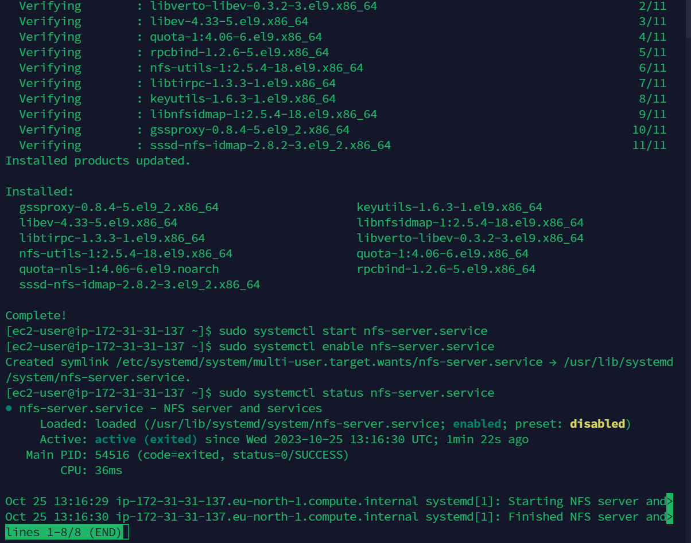

Ensure you set permission that will allow our webservers to read, write ans execute files on NFS: Use the commands below

`sudo chown -R nobody: /mnt/apps`

`sudo chown -R nobody: /mnt/logs`

`sudo chown -R nobody: /mnt/opt`

`sudo chmod -R 777 /mnt/apps`

`sudo chmod -R 777 /mnt/logs`

`sudo chmod -R 777 /mnt/opt`

`sudo systemctl restart nfs-server.service`

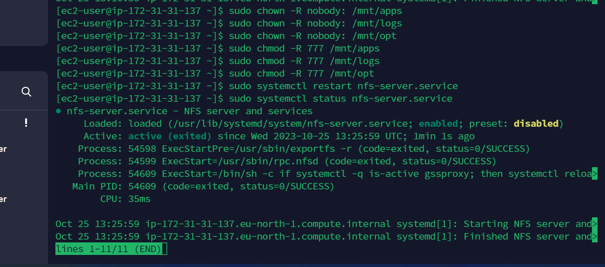

Configure access to NFS for clients within the same subnet. To check your `subnet cidr` open your EC2 page, locate networking tab and open subnet link. From there, you can access the IPv4 CIDR. Run the code below and configure your access to NFS for clients

`sudo vi /etc/exports`

`/mnt/apps <Subnet-CIDR>(rw,sync,no_all_squash,no_root_squash)`

`/mnt/logs <Subnet-CIDR>(rw,sync,no_all_squash,no_root_squash)`

`/mnt/opt <Subnet-CIDR>(rw,sync,no_all_squash,no_root_squash)`

`Esc + :wq!`

`sudo exportfs -arv`

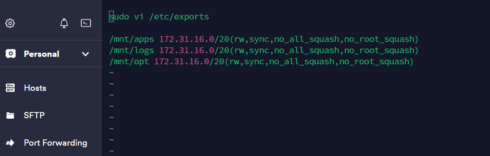

Check which port is used by NFS and open it using security Groups. Note that in order for NFS server to be accessible from your client, you must also open the following ports; TCP 111, UDP 111, UDP 2049, TCP 2049

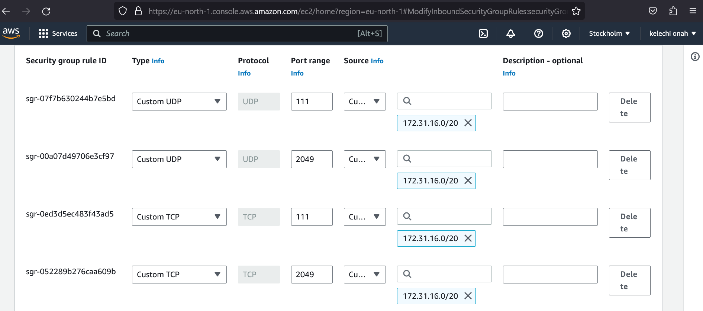

STEP2: CONFIGURE BACKEND DATABASE AS PART OF 3 TIER ARCHITECTURE

Install MySQL server

Create a database and name it `tooling`

Create a database user and name it `webaccess`

Grant permission to `webaccess` user on `tooling` database to do anything only from the webservers `subnet cidr`

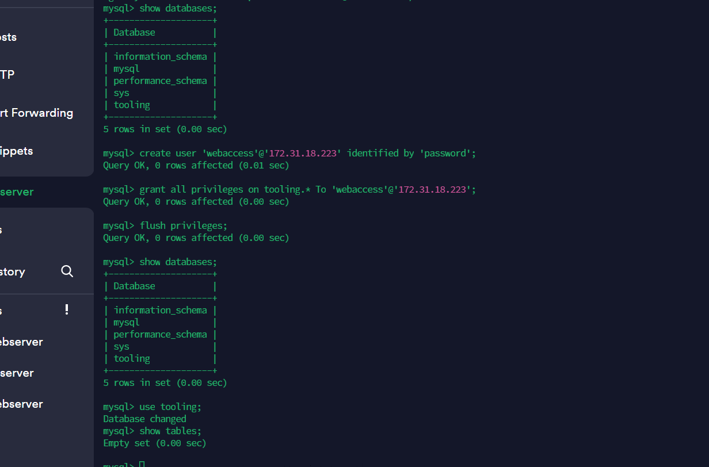

STEP3: PREPARE THE WEBSERVERS

We need to make sure that our Web Servers can serve the same content from shared storage solutions, in our case- NFS SERVER and MySQL database

`1` Run the command

`sudo yum install nfs-utils nfs4-acl-tools -y`

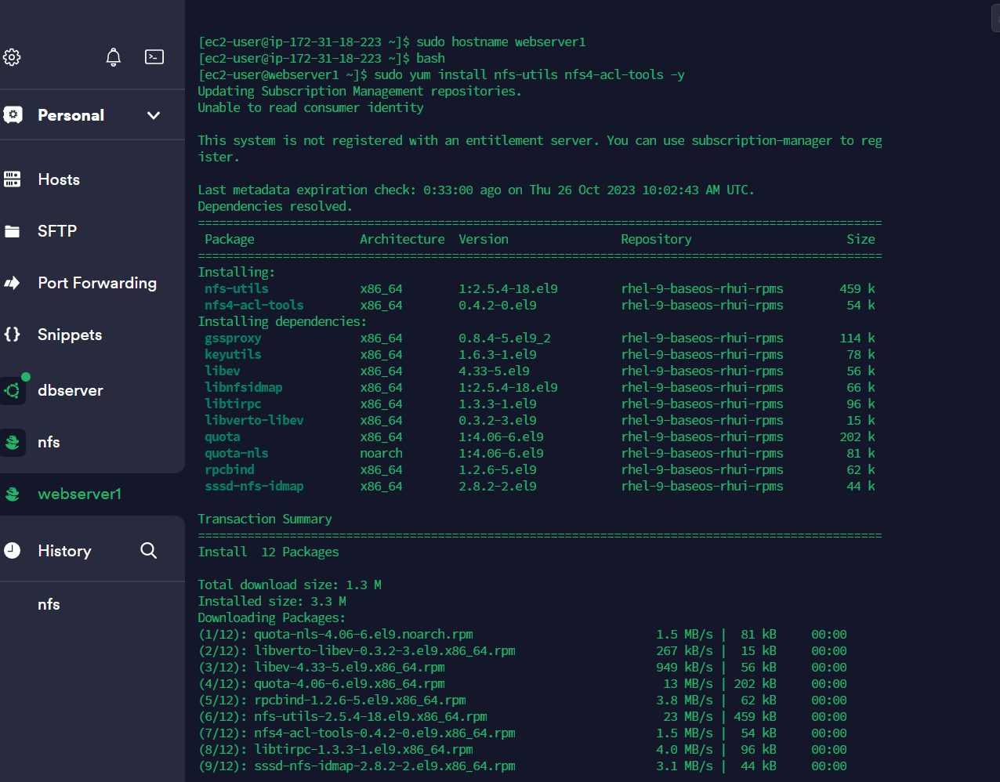

`2` Mount `/var/www` and target the NFS servers export for apps

`sudo mkdir /var/www`

`sudo mount -t nfs -o rw,nosuid <NFS-Server-Private-IP-Address>:/mnt/apps /var/www`

`3` Verify that NFS was mounted successfully by running `df -h` Make sure that the changes will persist on the Web server after reboot

`sudo vi /etc/fstab`

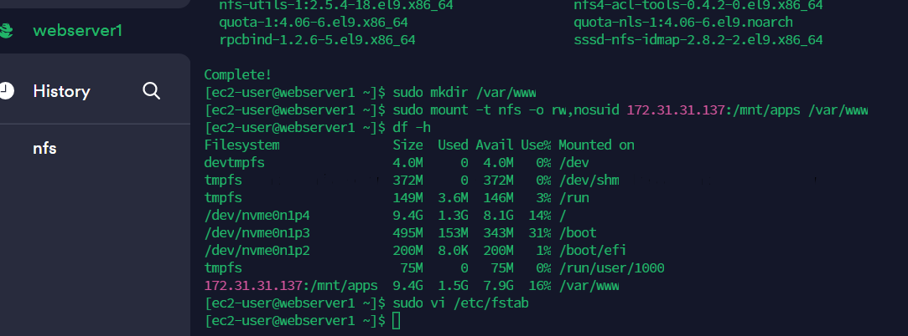

`4` Add the following line in your opened file

`<NFS-Server-Private-IP-Address>:/mnt/apps /var/www nfs defaults 0 0`

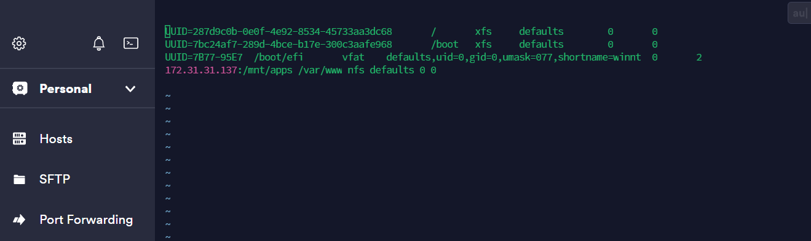

`5` Install Remi's repository, Apache and PHP withe the codes below

`sudo yum install httpd -y`

`sudo dnf install https://dl.fedoraproject.org/pub/epel/epel-release-latest-8.noarch.rpm`

`sudo dnf install dnf-utils http://rpms.remirepo.net/enterprise/remi-release-8.rpm`

`sudo dnf module reset php`

`sudo dnf module enable php:remi-7.4`

`sudo dnf install php php-opcache php-gd php-curl php-mysqlnd`

`sudo systemctl start php-fpm`

`sudo systemctl enable php-fpm`

`sudo setsebool -P httpd_execmem 1`

REPEAT STEPS 1-5 ON THE OTHER 2 WEBSERVERS

`6` Verify that Apache files and directories are avaiable on the  webserver in `/var/www` and also on the NFS server in `/mnt/apps`

`7` Locate the log folder for Apache on the webserver and mount it to NFS servers export for logs. Repeat `No4` to make sure the mount point persist after reboot.

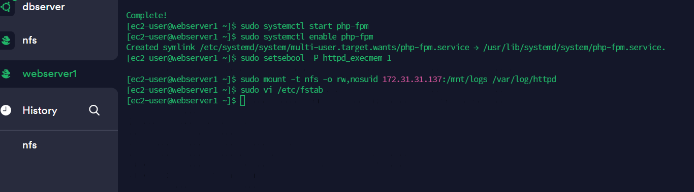

Repeating `No4`

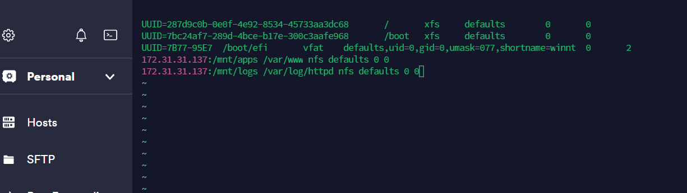

`8` Fork the tooling source code from `Darey.io Github Account` to your Github account. Also test if NFS is mounted correctly

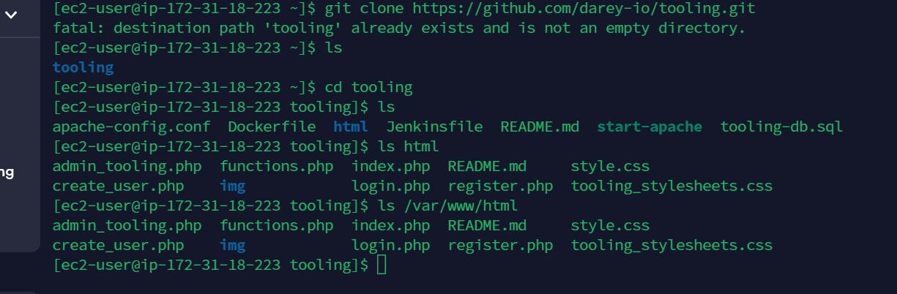

NOTE; DO NOT FORGET TO OPEN TCP PORT 80 ON THE WEB SERVER

ALSO NOTE THAT IF YOU ENCOUNTER ANY ERROR TRYING TO RUN YOUR IP ADDRESS ON YOUR, CHECK PERMISSIONS TO YOUR `/var/www/html` folder and also disable SELinux `sudo setenforce 0` TO MAKE THIS CHANGE PERMANENT, OPEN THE FOLLOWING CONFIG FILE `sudo vi /etc/sysconfig/selinux` AND SET `SELINUX-disabled`, then restart httpd

`9` Update the websites configuration to connect to the database in `/var/www/html/functions.php` 

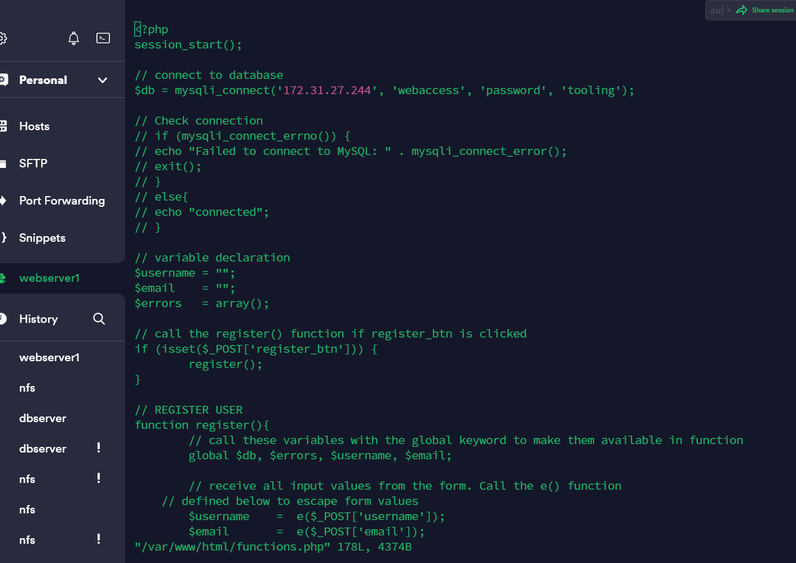

`10` Apply `tooling-db.sql` script to your database using this command 

`mysql -h <database-private-ip> -u <db-username> -p <db-password> <tooling-db.sql`

`11` Create in mysql a new admin user with username and password

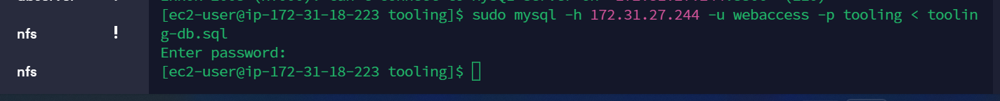

`12` Open the website in your browser using your public IP. You should be able to see the below results

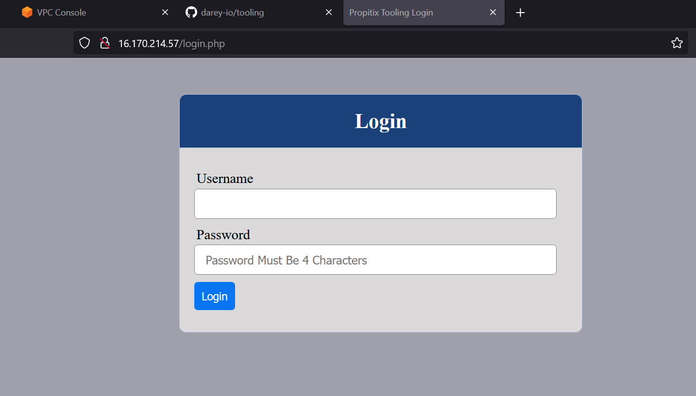

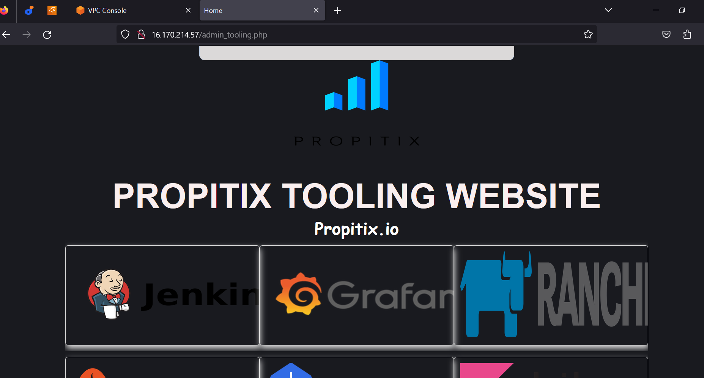

