ANISIBLE-AUTOMATE PROJECT

In this project, we will develop 'Ansible' scripts to stimulate the use of a 'Jump box/Bastion host' to acess our Web Servers. 

TASKS:

We will install and configure Ansible client to act as a jump Server/Bastion Host

We will also create a simple Ansible Playbook to automate servers configuration

`STEP 1` INSTALL AND CONFIGURE ANSIBLE ON EC2 INSTANCE

`1` Update the name tag on your Jekins EC2 instance to Jenkins-Ansible. We will use this server to run playbooks.

`2` In your GitHub account, create a new repository and name it `ansible-config-mgt`

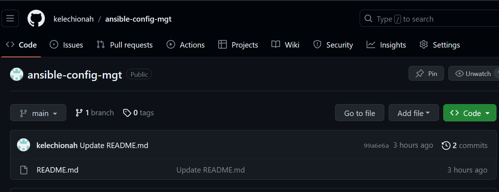

`3` Install Ansible. Run the command as follows

`sudo apt update`

`sudo apt install ansible`

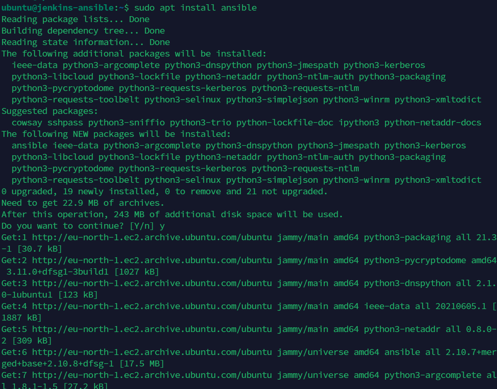

You can verify your insallation by running `ansible --version`

`4` Configure Jenkin build job to archive your repository content every time you change it.

`i` Create a new freestyle project `ansible` in Jenkins and point it to your `ansible-config-mgt` repository

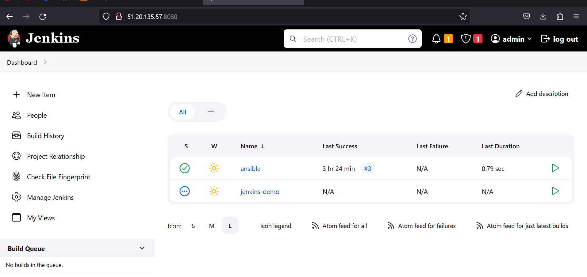

`ii` Configure a webhook in GitHub and set the weebhook to triger `ansible` build. 

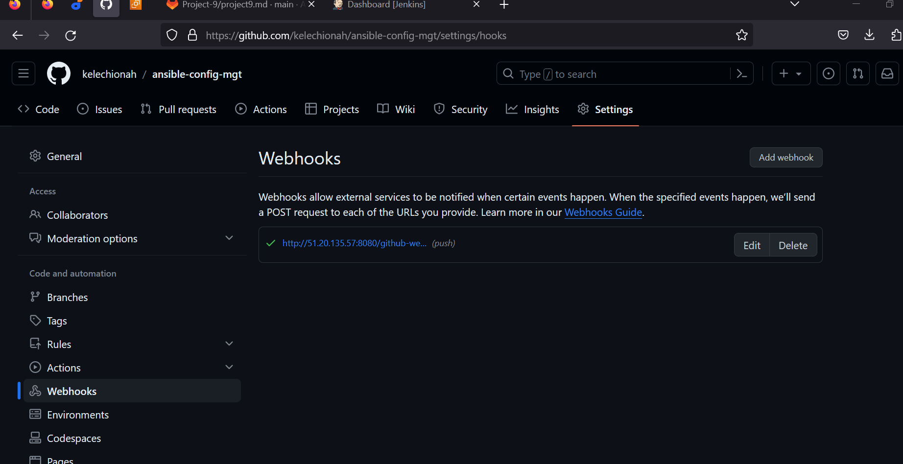

`iii` Configure a Post-build job to save all `**` files

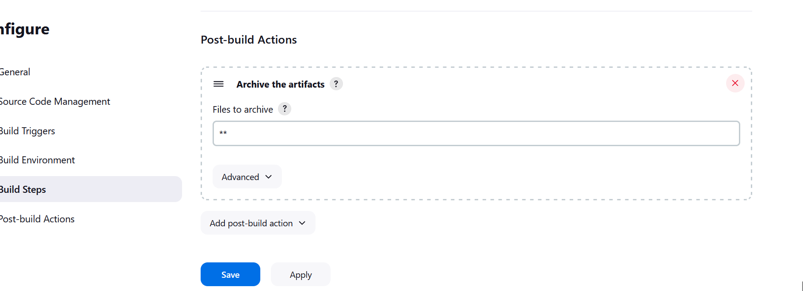

`5` Test your setup by making some changes in README.md file in `main` branch and make sure that build starts automatically and Jenkins saves the files in the folder `ls /var/lib/jenkins/jobs/ansible/builds/<build_number>/archive/`

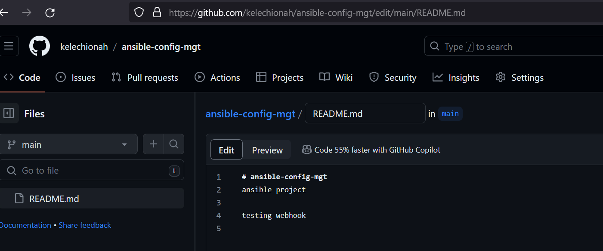

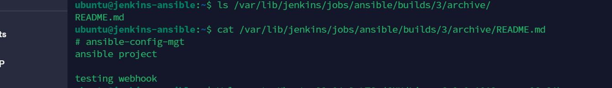

`STEP 2`PREPARE YOUR DEVELOPMENT ENVIRONMENT USING VISUAL STUDIO CODE

There are different IDEs and surce-code Editors for differnt languages with their own languages with their own advantages and drawbacks. i downloaded, installed and used `vscode`

AFter the installation, configure it to connect to your newly created GitHub repository. Clone down your ansible-config-mgt repo to your Jenkins-Ansible instance with the command `git clone <ansible-config-mgt repo link>`

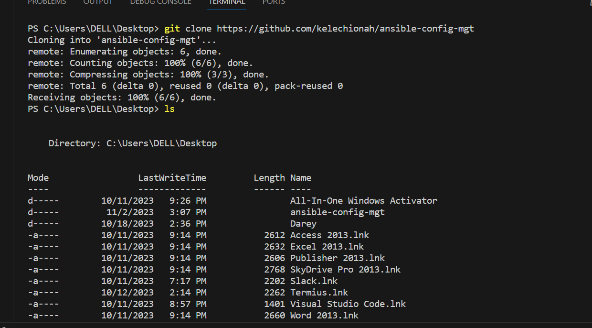

`STEP 3` BEGIN ANSIBLE DEVELOPMENT

`i` In your ansible-config-mgt Github repository, create a new branch that will be used for development of a nw feature.

`ii` Checkout the newly created feature branch to your local machine and start building yoyr code and directory structure.

`iii` Create a directory ad name it `playbooks`----it will be used to store all your playbook files.

`iv` Create a directory and name it `inventory`----it will be used to keep your hosts organised. 

`v` Within the playbooks folder, create your first palybook and name it `commom.yml`

`vi` Within the inventory folder, create an inventory file for each environment (development, staging, testing and production) dev,staging, uat and prod respectively.

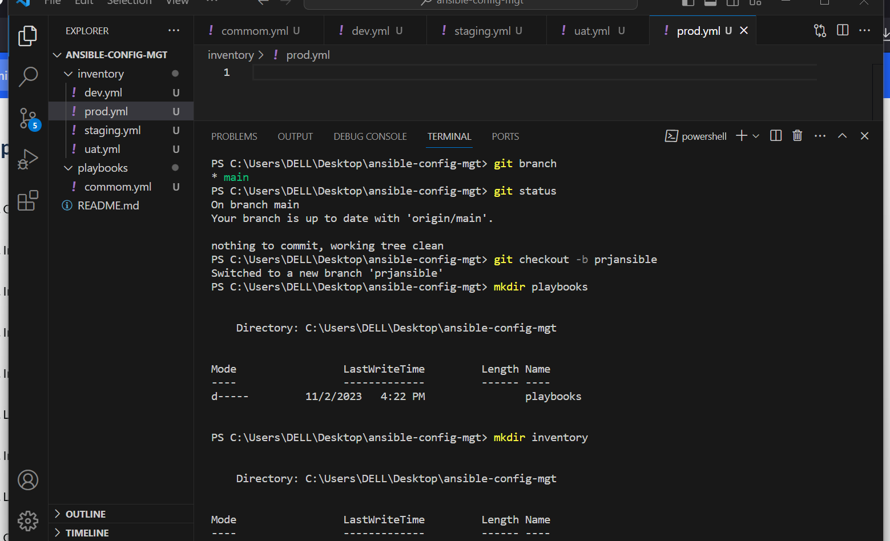

`STEP 4` SET UP AN ANSIBLE INVENTORY

NOTE: Ansible uses port 22 by default, which means it needs to ssh into target servers from Jenkins-Ansible host. For this you can implement the concept of ssh-agent. now you need to import your key into `ssh-agent`

use command `eval ssh-agent -s`
`ssh-add <path-to-private-key>`

ssh into your Jenkins-Anisble server using ssh-agent. USe command `ssh -A ubuntu@public-ip`

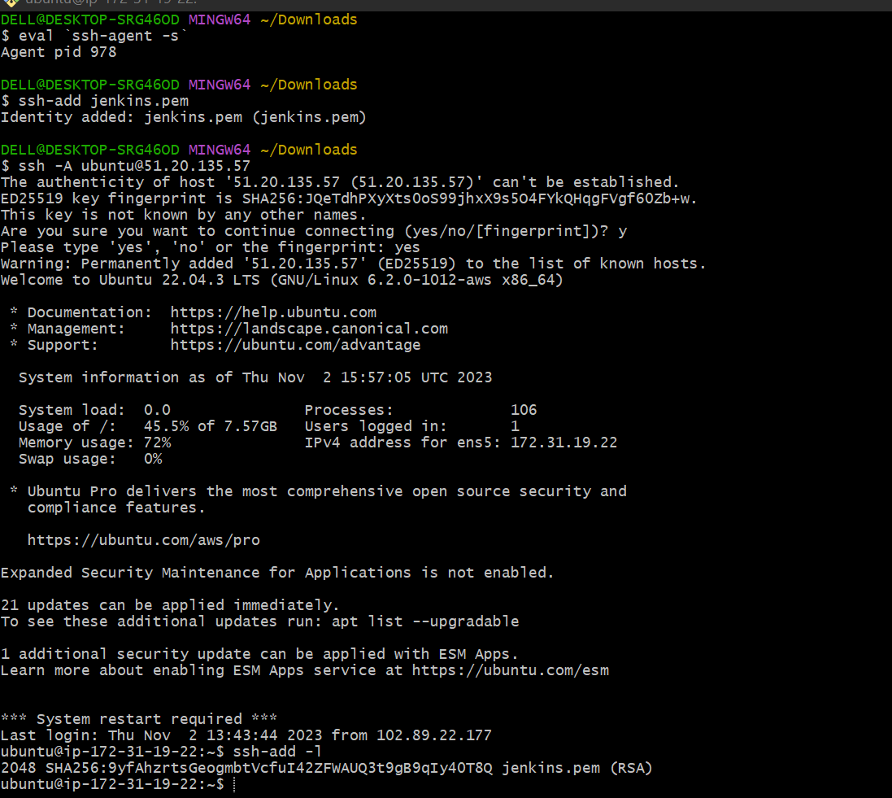

Update your `inventory/dev.yml` file with this snippet of code:

[nfs]
<NFS-Server-Private-IP-Address> ansible_ssh_user=ec2-user

[webservers]
<Web-Server1-Private-IP-Address> ansible_ssh_user=ec2-user
<Web-Server2-Private-IP-Address> ansible_ssh_user=ec2-user

[db]
<Database-Private-IP-Address> ansible_ssh_user=ec2-user 

[lb]
<Load-Balancer-Private-IP-Address> ansible_ssh_user=ubuntu

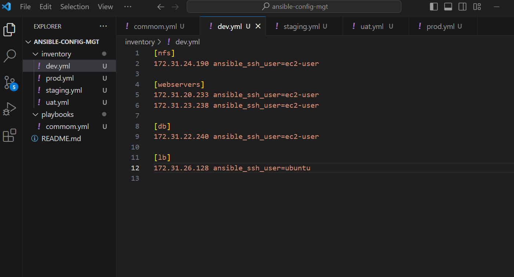

`STEP 5` CREATE A COMMOM PLAYBOOK

It is time to start giving  Ansible the instructions on what you need to be performed on all servers listed in inventory/dev

In `commom.yml`playbook you will write configuration for repeatable, re-useable and multi-machine tasks that is common to systems within the infrastructure.

Update your `playbooks/commom.yml`file with the following codes

---
- name: update web, nfs and db servers
  hosts: webservers, nfs, db
  become: yes
  tasks:
    - name: ensure wireshark is at the latest version
      yum:
        name: wireshark
        state: latest
   

- name: update LB server
  hosts: lb
  become: yes
  tasks:
    - name: Update apt repo
      apt: 
        update_cache: yes

    - name: ensure wireshark is at the latest version
      apt:
        name: wireshark
        state: latest

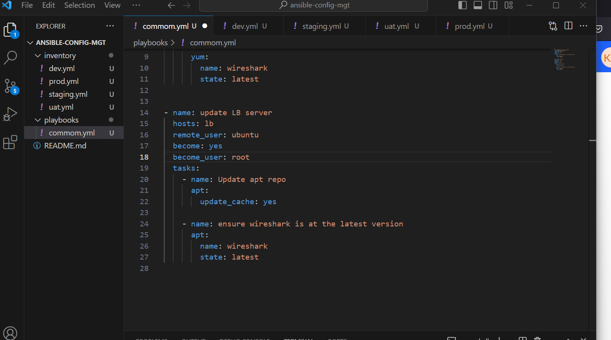

`STEP 6` UPDATE GIT WITH THE LATEST CODE

`i` Commit your code into github. Use git commands to add, commit and push your branch to GitHub. 

`git status`

`git add <selected files>`

`git commit -m "commit message"`

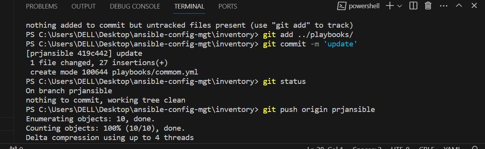

`ii` Create a pull request

`iii` Act like another developer for a sceond, and act as a reviewer.

`iv` If the othe developer is happy with your new feature development, merge the code to the `main branch`

`v` Head back on your terminal, checkout from the feature branch into the main, and pull down the latest changes.

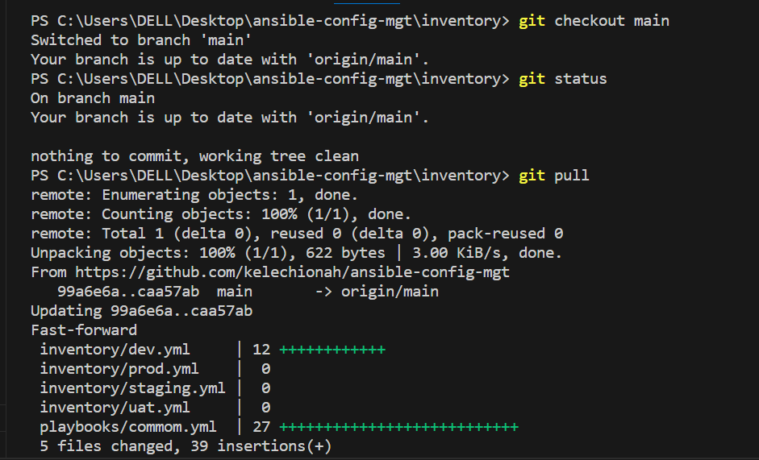

Once your code changes appear in `main` branch, Jenkins will do its job and save all the files (build artifacts) to `/var/lib/jenkins/job/ansible/builds/<build_number>/archive/` directory on `Jenkins-Ansible` server.

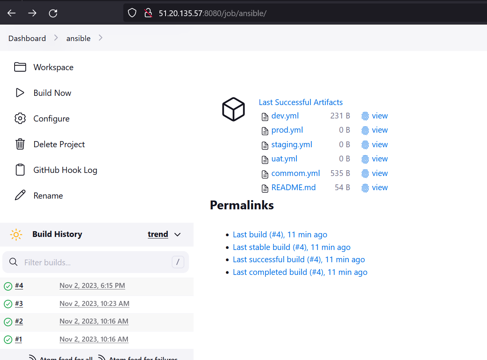

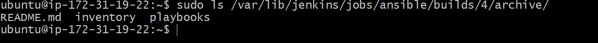

`STEP 7` RUN FIRST ANSIBLE TEST

`i` Setup your VScode to connect to your instance. For Linux users, check the video on `ssh-agent on linux` For windows users, check `ssh-agent on windows`

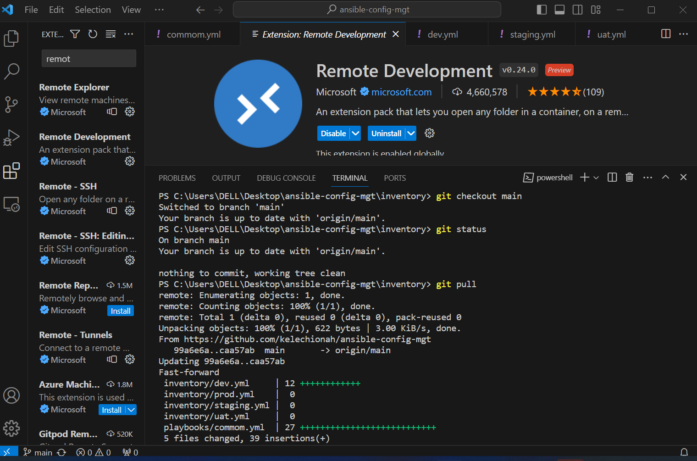

Change directory into your `ansible-config-mgt`

`cd ansible-config-mgt`

Run your playbook with the command below

`ansible-playbook -i inventory/dev.yml playbooks/common.yml`

WIth great network, your playbook should execute successfully.

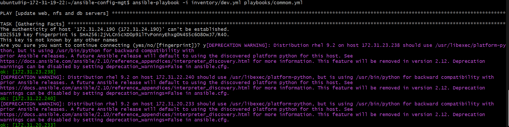

You can also verify to check if `wireshark` has been installed in your servers by going into the server and running command `wireshark --version or which wireshark`

---------------------------------------------------------THANK YOU FOR WATCHING------------------------------------