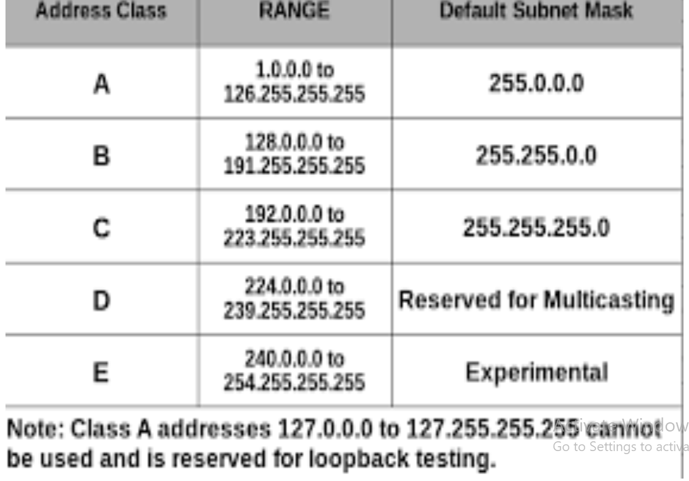

Understanding IP Addresses and CIDR Notation

An IP Address is a unique address that identifies a device on the internet or a local network. IP stands for `Internet Protocal` which is the set of rules governing the format of data sent via the internet or local network. In essence, IP addresses are the identifier that allows information to be sent between devices on a network: they contain locataion information and make devices accessible for communication. The internet needs a way to differentiate between different computers, routers, and websites. IP addresses provide a way of doing so and form an essential part of how the internet works.

An IP address is a string of numbers seperated by periods. IP addresses are expressed as a set of four numbers -- an example address might be 88.99.987.9. Each number in the set ca range from 0 to 255. So, the full IP addressing range goes from 0.0.0.0 to 255.255.255.255. IP addresses are not random. They are mathematically produced and allocated by the Internet Assigned Numbers Authority (IANA), a devision of the Internet Corporation for Assigned Names and Numbers (ICANN). ICANN is a non-profit organisation that was established in the United States in 1998 to help maintain the security of the internet and allow it to be usable by all. Each time anyone registers a domain on the internet, they go through a domain name registrar, who pays a small fee to ICANN to register the domain. 

SUBNETTING AND SUBNET MASKS

Subnetting is the practice of dividing a network into two or smaller networks. It increases routing efficiency, which helps to enhance the security of the network and reduces the size of the broadcast domain.

IP subnetting designates high-order bits from the host as part of the network prefix. This method divides a network into smaller subnets.

It also helps you to reduce the size of the routing tables, which is stored in routers. This method also helps you to extend the existing IP address base and restructure the IP address.

A `Subnet Mask` is a 32 bits address used to distinguish between a network address and a host address in IP address.  A subnet masks identifies which part of an IP address is the network address and the host address. They are not shown inside the data packets traversing the internet. They carry the destination IP address, which a router will match with a subnet

CIDR Notation and Address Aggregation

Classless Inter-Domain Routing (CIDR) is an IP address allocation method that improves data routing efficiency on the internet. Every machine, server, and end-user device that connects to the internet has a unique number, called an IP address, associated with it. Devices find and communicate with each other by using these IP addresses. Organisations use CIDR to allocate IP addreses flexibly and efficiently in their networks.

`IP Address Aggregator`

This is a utility developed to automated minimization process and convert bunch of IPv4 addresses into smallest continous range(s) possible. IP aggregation is commonly performed by network engineers working with BGP & routers. This utility will help webmastrs to configure server firewalls, apache .htaccess files, address masks and so on.

IP Address Classes and Private IP Address Ranges

Classful addressing is a network addressing the internets architecture from 1981 till Classless Inter-Domain Routing was introduced in 1993

This addressing method divides the IP addresses into five seperate classes based on four address bits.

Here, classes A,B,C offers addresses for networks of three distinct network sizes. Class D is only used for multicast, and Class E reserverd exclusively for experimental purposes.

Let's see each of the network classes in details:

`Class A Network`

This IP address class is used when there are a large number of hosts. In a Class A type of network, the first 8 bits (also called the first octet) identify the network, and the remaining 24 bits for the host into that network.

An example of class A address is 102.168.212.226. Here, "102" helps you identify the network and 168.212.226 identify the host.

Class A address 127.0.0.0 to 127.255.255.255 cannot be used and is reserved for loopback and diagnostic functions.

`Class B Network`

In a B class IP address, the binary addresses start with 10.  In this IP address, the class decimal number can be between 128 to 191. The number 127 is reserved for loopback which is used for internal testing on local machine. The first 16 bits (know as two octets) help you identify the network. The other remaiming 16 bits helps you identify the host within the network.

An example of Class B address is 168.212.226.204 where 168.212 identifies te network and 226.204 identifies the host

`Class C Network`

Class C is a type of IP address that is used for small networks. In this class, three octets are used to identify the network. the IP range between 192 to 223

In this type of network addressing method, the first two bits are set to be one, and the third bit is set to be 0, which makes the first 24 bits of the address and the remaining bit as host address. Mostly local area network use Class C IP address to connect with the network. 

Example for a class C IP address is 192.168.178.1

`Class D Network`

Class D addresses are only used for multicasting applications. Class D is never used for regular networking operations. This class addresses the first three bits set to "1" and their fourth bit set to use for "0". Class D addresses are 32-bit network addresses. All the values within the range are used to identify multicast groups uniquely.

Therefore there is no requirement to extract the host addressfrom the IP address, so Class D does not have anuy subnet mask. Example for a Class D IP address is 227.21.6.173

`Class E Network` 

Class E address is defined by including the starting four network address bits as, which allows you to insorporate addresses from 240.0.0.0 to 255.255.255.255. However, E class is reserverd, and its usage is never defined. herefor, many network implementations discard these addresses as undefined or illegal. 

Example for a Class E IP address is 243.164.89.28

Limitations of classful IP addressing;

Risk of running out of address space soon. Class boundaries did not encourage efficient allocation of address space rule for assigning network ID. The Network ID will be assigned based on the below given rules:

The network ID cannot start with 127 because 127 belongs to class A address and its reserved for internal loopback functions. All bits of Network ID set to 1 are reserved for use as an IP broadcast address and cannot be used. All bits of network ID are set to 0. They are used to denote a particular host on the local network and should not be routed.

ADVANCED TOPICS IN IP ADDRESSING

Advanced topic in TCP/IP networking involve the study of advanced technologies and techniques for managing and optimizing networks performances. 

These may include `Routing Protocal`, which are used to exchange information about network destinations between devices on a network. They are an important components of advanced TCP/IP networking topics, as they play a key role in determining the best path for data to travel from one device to another. 

 Virtual Private Networks [VPNs], which enable users to securely connect to a private network over the internet; 
 
 `Quality of Services [QoS]`, which is set of technologies and techniques that are used to manage and optimize network performance; 
 
 `Domain Name System [DNS]`, which is a hierarchial, distributed database that is used to translate human-readable domain names into machine-readable IP addresses; and 
 
 `Network Address Translation [NAT]`, which is a technique that is used to allow devices on a private network to communicate with devices on a public network.

