SHELL SCRIPTING HANDS-ON PROJECT

Shell scripting helps automate repetitive tasks. we can do the job of cloning a thousand repositories by simply 

writing a script. Bash scripts are essentially a series of commands and instructions that are executed sequentially 

in a shell. You can creat a shell script by creating a collection of commands in a text file with a .sh extention. 

These scripts can be executed directly from the command line or called from other scripts. 

SHELL SCRIPTING SYNTAX ELEMENTS

VARIABLES; Bash allows you to define and work with variables.Variables can store data of various types such as numbers, strings and arrays. You can assign values to 

valuables using the =operator and access their values using the variable name preceded by a $sign.

CONTROL FLOW; Bash provides control flow statements like if-else, for loops, while loops, and case statemnents to 

control the flow of execution in your scripts.These statements allows you to make decisions, iterate over lists and 

execute different commands based on conditions.

COMMAND SUBSTITUTION; This allows you to capture the output of a command and use it as a value within your script. 

You can use the backtick or the $()syntax for command substitution.

INPUT AND OUTPUT; Bash provides various ways to handle input and output. You can use the read command to accept 

user input, and output text to the console using the echo command. Additionally, you can redirect input and output 

using operators like > (output to a file), and | (pipe the output of one command as input to another)

FUNCTIONS; Bash allows you to define and use functions to group related commands together. Functions provide a way 

to modularize your code and make it more reusable. You can define functions using the function keyword or simply by 

declaring the function name followed by parentheses.

---------------LETS GET HANDS-ON AND PRACTICE OUR SHELL SCRIPT--------------------

On your terminal, make a new directory by doing `mkdir shell-scripting`
creat a file by doing `touch user-input.sh`

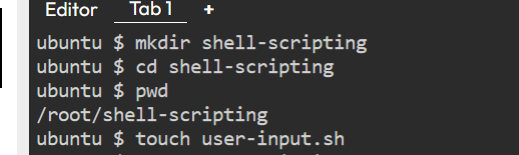

open the file with nano and paste the following block of codes

#!/bin/bash

# Prompt the user for their name
echo "Enter your name:"
read name

# Display a greeting with the entered name
echo "Hello, $name! Nice to meet you."

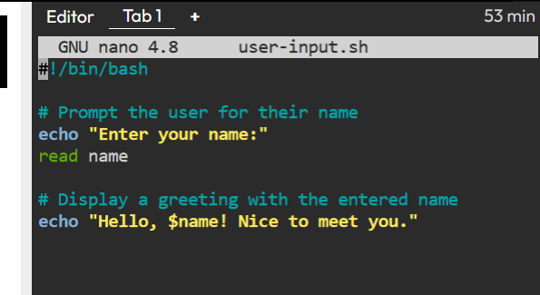

After saving the file, rund the command `sudo chmod +x user-input.sh` This makes the file executable. then run the script using the command `./user-input.sh`

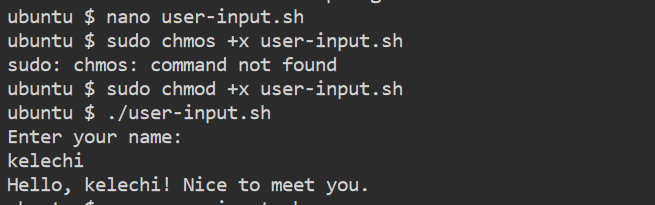

DIRECTORY MANIPULATION AND NAVIGATION

Create a file named navigating-linux-filesystem.sh and open it with an editor. Paste the following codes block

#!/bin/bash

# Display current directory
echo "Current directory: $PWD"

# Create a new directory
echo "Creating a new directory..."
mkdir my_directory
echo "New directory created."

# Change to the new directory
echo "Changing to the new directory..."
cd my_directory
echo "Current directory: $PWD"

# Create some files
echo "Creating files..."
touch file1.txt
touch file2.txt
echo "Files created."

# List the files in the current directory
echo "Files in the current directory:"
ls

# Move one level up
echo "Moving one level up..."
cd ..
echo "Current directory: $PWD"

# Remove the new directory and its contents
echo "Removing the new directory..."
rm -rf my_directory
echo "Directory removed."

# List the files in the current directory again
echo "Files in the current directory:"
ls

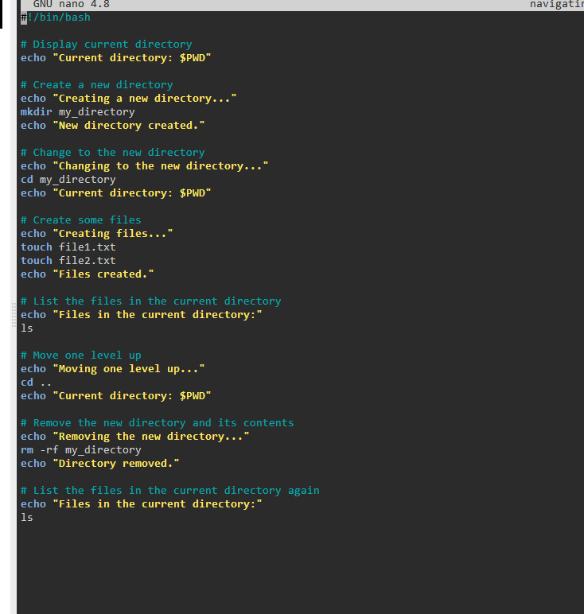

Run the command `sudo chmod +x navigating-linux-filesystem.sh` to set execute permission on the file.

Run the script using this command `./navigating-linux-filesystem.sh`

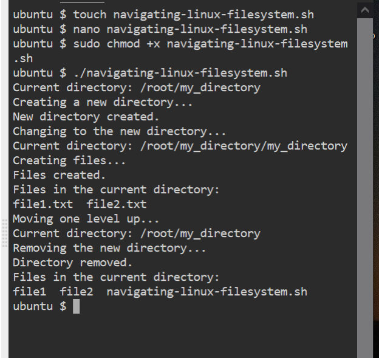

FILE OPERATIONS AND SORTING

Create a file on your terminal called sorting.sh by running `touch sorting.sh` then open with an editor. Copy and pasted the following code block into the opned file

#!/bin/bash

# Create three files
echo "Creating files..."
echo "This is file3." > file3.txt
echo "This is file1." > file1.txt
echo "This is file2." > file2.txt
echo "Files created."

# Display the files in their current order
echo "Files in their current order:"
ls

# Sort the files alphabetically
echo "Sorting files alphabetically..."
ls | sort > sorted_files.txt
echo "Files sorted."

# Display the sorted files
echo "Sorted files:"
cat sorted_files.txt

# Remove the original files
echo "Removing original files..."
rm file1.txt file2.txt file3.txt
echo "Original files removed."

# Rename the sorted file to a more descriptive name
echo "Renaming sorted file..."
mv sorted_files.txt sorted_files_sorted_alphabetically.txt
echo "File renamed."

# Display the final sorted file
echo "Final sorted file:"
cat sorted_files_sorted_alphabetically.txt

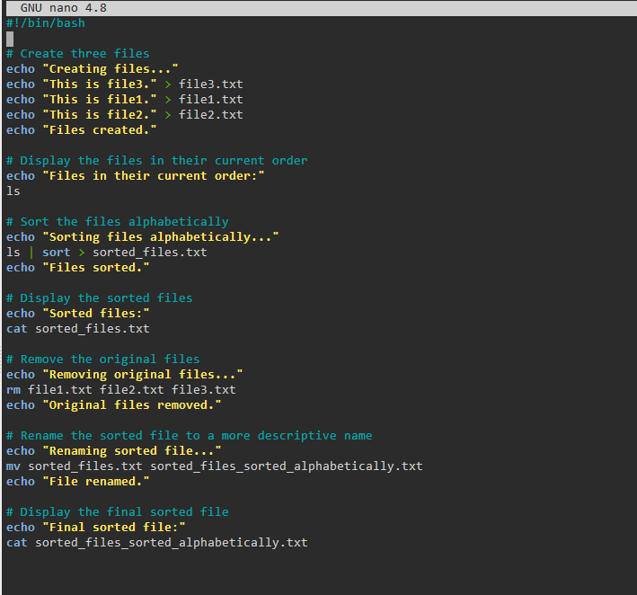

Set execute permission on sorting.sh using this command `sudo chmod +x sorting.sh` 

Run the script using `./sorting.sh`

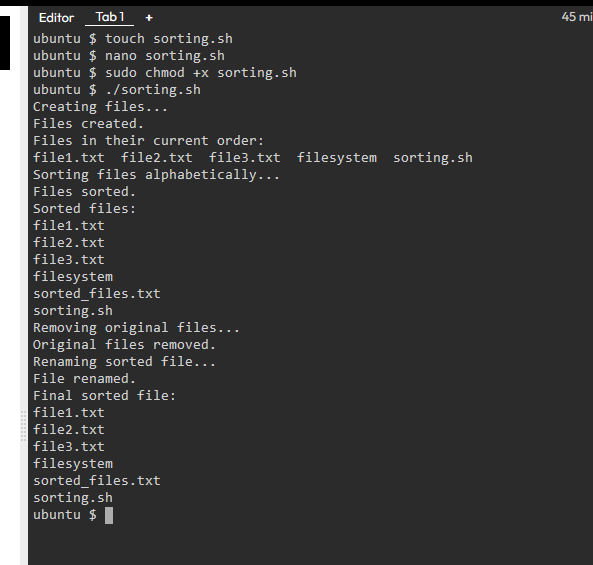

WORKING WITH NUMBERS AND CALCULATIONS

On your terminal, `touch calculations.sh` then open with an editor and paste the following code bloacks inside

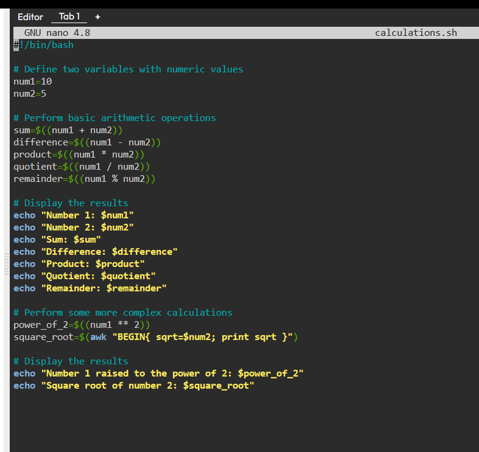

Set execute permissible on `calculations.sh` using the command `sudo chmod +x calculations.sh`

Run your script using the command `./calculations.sh`

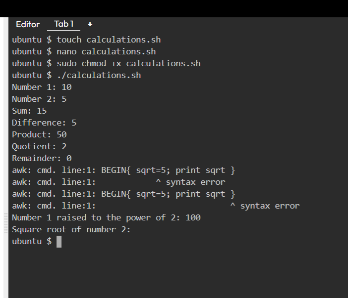

FILE BACKUP AND TIMESTAMPING

On your terminal, open a file using the touch command `touch backup.sh` Open the file using an editor and paste the following code block below

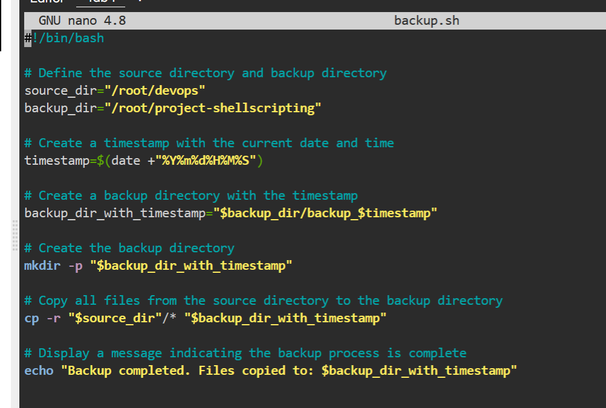

Set execute permission on backup.sh using `sudo chmod +x backup.sh`

Run your script using the command `./backup.sh`

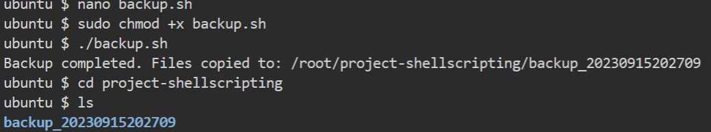

-------------------------------------THANK YOU FOR WATCHING-------------------------------

