IMPLEMENTING LOAD BALANCER WITH NGINX

Load balancing is like having a team of helpers to make sure a big job gets done smoothly and efficiently. It means 

distributing the work or tasks among several computers or severs so that no one computer gets overloaded with too 

much work. this helps to keep everything running smoothly and ensures that websites and apps work quickly and dont get slow. Its like teamwork for computers.

A load balancer stands in front of the webservers, all traffic gets to it first, it then distributes the traffic across the set of webservers. this is the ensure no webserver get over worked, consequently improving system performance.

Nginx is a versatile software, it can act like a webserver, reverse proxy, and a load balance. In this project, we will be working you through how to configure Nginx as a load balancer.

STEP 1: Spin up two EC2 instances running ubuntu

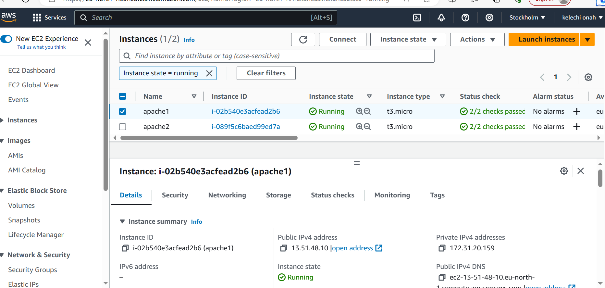

STEP 2: We will open port 8000 to allow traffic from anywhere

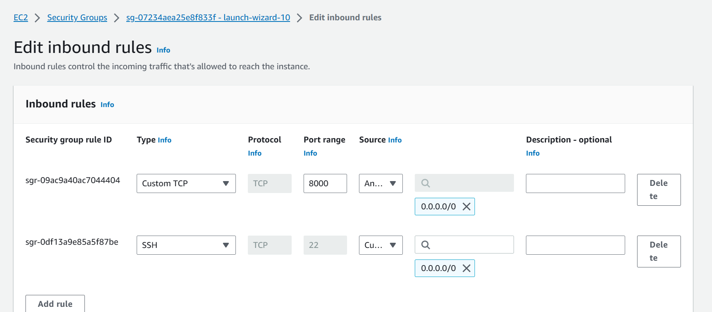

STEP 3: Connect to each of the webservers via ssh and Install Apache Websever on both servers by running the command `sudo apt update -y && sudo apt install apache2 -y`

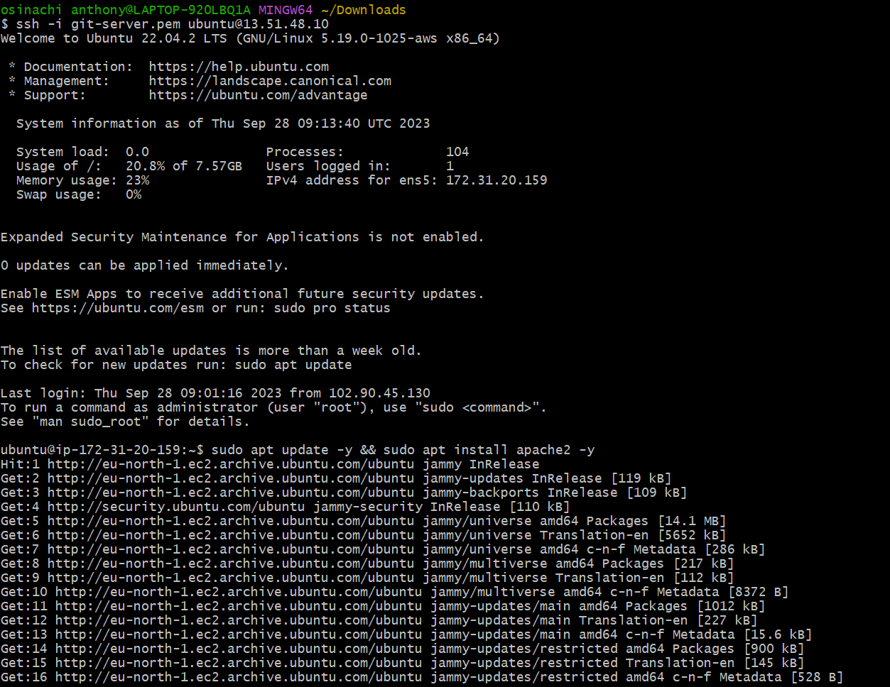

Verify that Apache is running using the command `sudo systemctl status apache2`

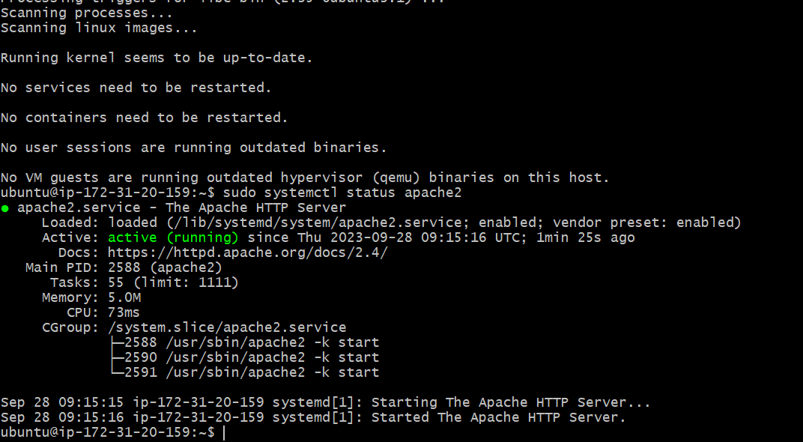

STEP 4: Configure Apache to serve a page showing its public IP (keep in mind the port is on 8000)

Using a text editor, open the file `sudo vi /etc/apache2/ports.conf`

Inside the file, add a new listen directive fort port 8000;

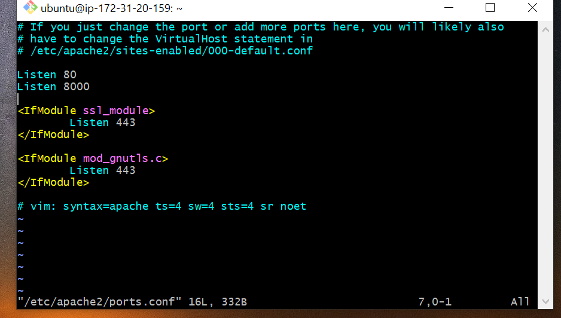

Next, open the file `sudo vi /etc/apache2/sites-available/000-default.conf` and change port 80 on the virtualhost to 8000

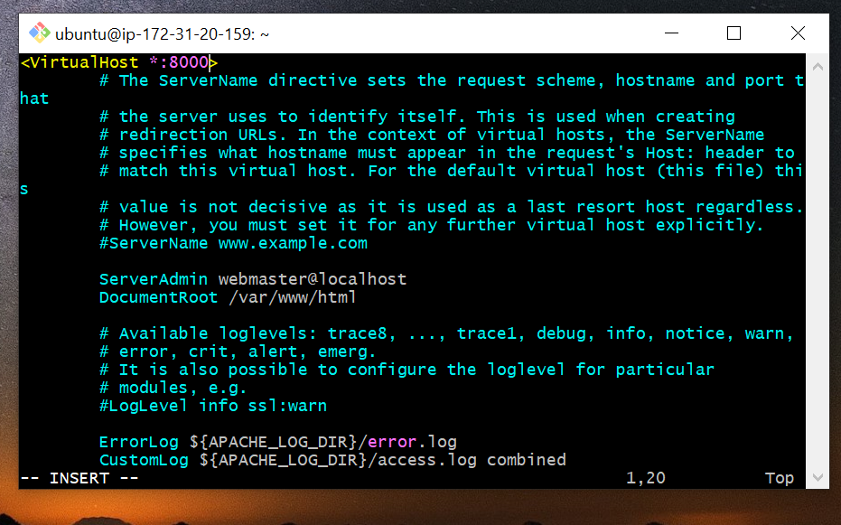

Save and close the file using esc, :wq! and enter

Open a new `index.html` file with the command `sudo vi index.html`

When the file is open, copy the html file below inside it. Get the public IP of your EC2 instance and replace the placeholder text for IP address in the html file

        <!DOCTYPE html>
        <html>
        <head>
            <title>My EC2 Instance</title>
        </head>
        <body>
            <h1>Welcome to my EC2 instance</h1>
            
Public IP: YOUR_PUBLIC_IP

        </body>
        </html>

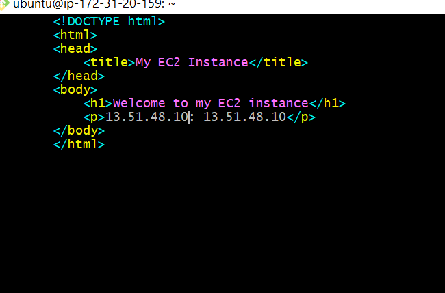

Run the code `sudo chown www-data:www-data ./index.html` to change file ownership of the index.html file.

Use the command `sudo cp -f ./index.html /var/www/html/index.html` to override the default html file of Apache webserver

Restart the webserver to load the new configuration using the command `sudo systemctl restart apache2`

Copy the public IP of your webservers and run it with 8000. You should see the output like below

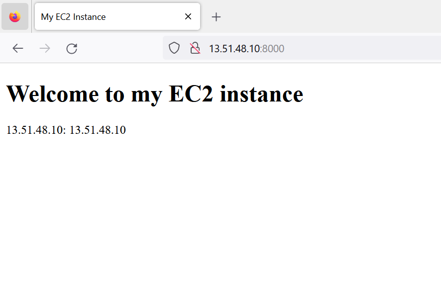

`YOU SHOULD NOTE THAT ALL THE STEPS ABOVE SHOULD BE CARRIED OUT ON THE TWO WEBSERVERS RUNNING`

STEP 5: Configuring Nginx as a load balancer

Provision a new EC2 instance running ubuntu. Make sure port 80 is open to accept traffic from anywhere. SSh into the instance and install nginx by using the comman `sudo apt update -y && sudo apt install nginx -y`

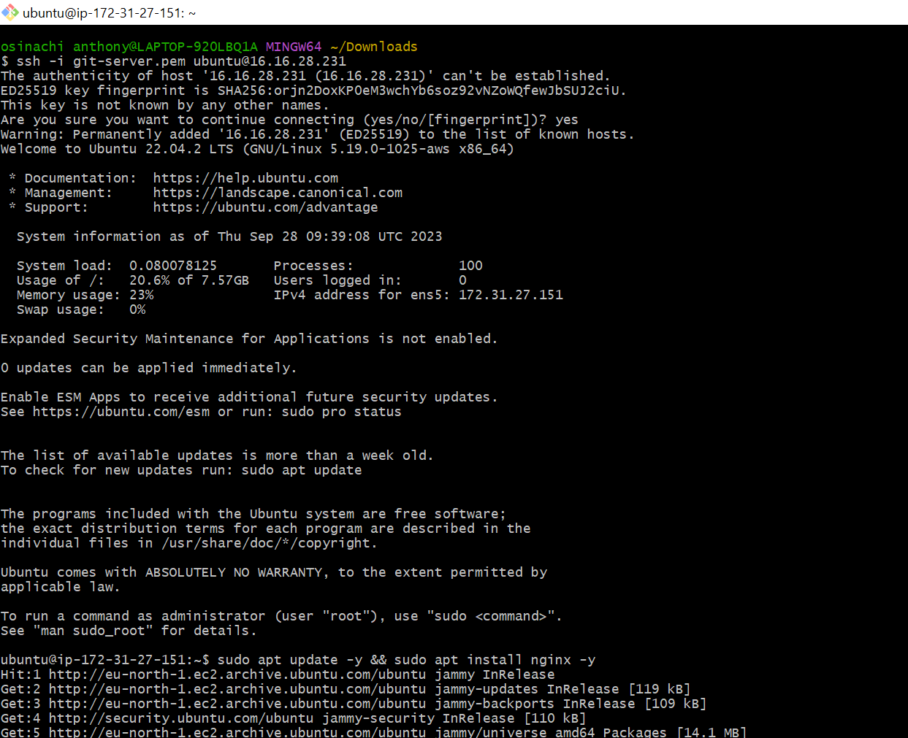

Verify that nginx is propely installed and running by running `sudo systemctl status nginx`

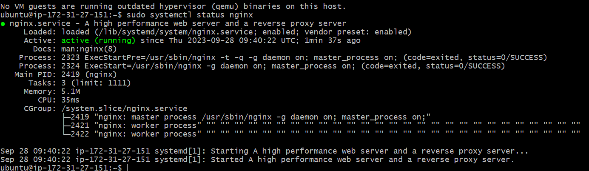

Open nginx configuration file with the command `sudo vi /etc/nginx/conf.d/loadbalancer.conf`

Paste the configuration file below to configure nginx to act as a load balancer. Make sure you edit the file and provide the necessary information.

         upstream backend_servers {

            # your are to replace the public IP and Port to that of your webservers
            server 127.0.0.1:8000; # public IP and port for webserser 1
            server 127.0.0.1:8000; # public IP and port for webserver 2

        }

        server {
            listen 80;
            server_name <your load balancer's public IP addres>; # provide your load balancers public IP address

            location / {
                proxy_pass http://backend_servers;
                proxy_set_header Host $host;
                proxy_set_header X-Real-IP $remote_addr;
                proxy_set_header X-Forwarded-For $proxy_add_x_forwarded_for;
            }
        }

        
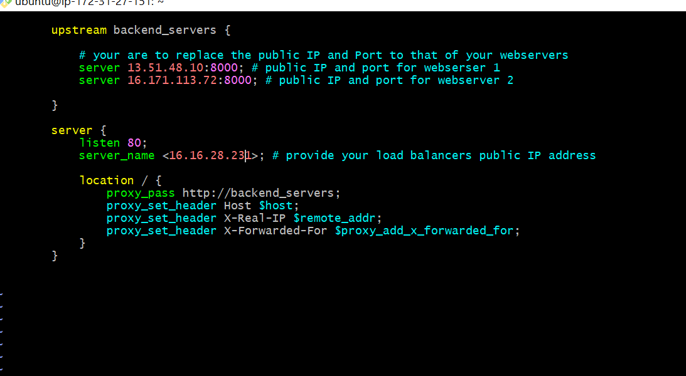

Upstream backend_servers defines a group of backend servers. the server lines inside the upstream block list the addresses and ports of your backend servers. Proxy_pass inside the location block sets up the load balancing, passing the requests to the backend servers. the proxy_set_header lines pass necessary headers to the backend servers to correctly handle the requests.

Test your configuration with the command `sudo nginx -t`

If there are no errors, restart Nginx to load  the new configuration with the command `sudo systemctl restart nginx`

Run the public IP address of the load balancer on a browser, you should see the same webpages served by the webservers

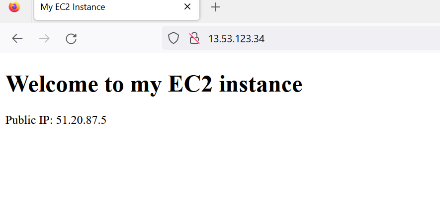

LOAD BALANCING ALGORITHMS

These are techniques used to distribute incoming network traffic or workload across multiple servers, ensuring efficient utilization of resources and improving overall system performance, reliability, and availblity. here are some common load balancer algorithms;

`ROUND ROBIN`---This algorithm distributes requests sequentially to each server in th pool.It is simple to implement and ensures an even distribution of traffic. It works well when all servers have similar capablities and resources.

`LEAST CONNECTIONS`---This algorithm routes new requests to the servers with the least number of active connections. It is effective when servers have varying capacities or workloads, as it helps distribute traffic to the least busy server.

`WEIGHTED ROUND ROBIN`---Similar to round robins, but servers are assigned different weights based on their capabilites. Servers with higher capacities recieve more requests. This approach is useful when servers have varying capacities or performance levels.

`WEIGHTED LEAST CONNECTIONS`---Similar to least connections algorithms, but servers are assigned different weights based on their capabilities. Servers with higher capacities recieve more connections. This approach balances traffic based on server capacities.

`IP HASH`---This algorithm uses a hash function based on the clients IP address to consistently map the client to a specific server. This ensures that the same client always reaches the same server, which can be helpful for maintaining session data or stateful connections.

--------------------------------------------------`THANK YOU FOR READING`-------------------------------------------