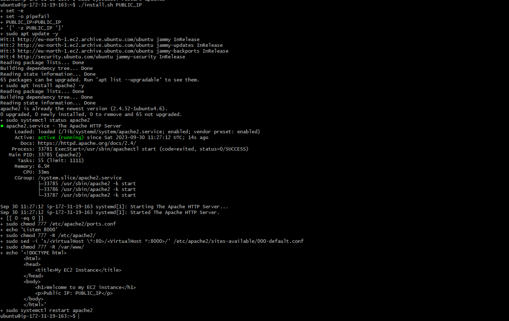

AUTOMATING LOADBALANCER CONFIGURATION WITH SHELL SCRIPTING

This project demonstrates how to automate the setup and maintenance of your load balancer using a freestyle job, enhancing efficiency and reducing manual effort.

In Project7 which was implementing load balancer with Nginx course, we deployed two backend servers, with a load balancer distributing traffic across the webservers. we did that by typing commands right on our terminal. 

In this course, we will be automating the entire process. we will do that by writing a shell script that when ran, all that we did manually will be done automatically. Automation is the heart of the work we do as DevOps engineers. Automation helps us speed the deployment of services and educe the chance of making errors in our day to day activities.

STEP 1: DEPLOYING AND CONFIGURING THE WEBSERVERS.

`1` Provision an EC2 instance running ubuntu.

`2` Open port 8000 to allow traffic from anywhere using the security group, edit inbound rules and add rule. Then save

`3` Connect to the web server via the terminal using SSH Client

`4` Open a file using `sudo vi install.sh` and paste the script below inside the file. Ensure to edit with your correct IP address. When done, press the `esc` button and `:wq!` and press enter to save

#!/bin/bash

####################################################################################################################
##### This automates the installation and configuring of apache webserver to listen on port 8000
##### Usage: Call the script and pass in the Public_IP of your EC2 instance as the first argument as shown below:
######## ./install_configure_apache.sh 127.0.0.1
####################################################################################################################

set -x # debug mode
set -e # exit the script if there is an error
set -o pipefail # exit the script when there is a pipe failure

PUBLIC_IP=$1

[ -z "${PUBLIC_IP}" ] && echo "Please pass the public IP of your EC2 instance as an argument to the script" && exit 1

sudo apt update -y &&  sudo apt install apache2 -y

sudo systemctl status apache2

if [[ $? -eq 0 ]]; then
    sudo chmod 777 /etc/apache2/ports.conf
    echo "Listen 8000" >> /etc/apache2/ports.conf
    sudo chmod 777 -R /etc/apache2/

    sudo sed -i 's/<VirtualHost \*:80>/<VirtualHost *:8000>/' /etc/apache2/sites-available/000-default.conf

fi
sudo chmod 777 -R /var/www/
echo "<!DOCTYPE html>
        <html>
        <head>
            <title>My EC2 Instance</title>
        </head>
        <body>
            <h1>Welcome to my EC2 instance</h1>
            
Public IP: "${PUBLIC_IP}"

        </body>
        </html>" > /var/www/html/index.html

sudo systemctl restart apache2

`5` When you are done editing and saving the script, change the permission of the file to make it executable using the command `sudo chmod +x install.sh`

`6` Run the shell script using the command `./install.sh PUBLIC_IP`

`PS: ENSURE YOU RUN THESE SAME STEPS ON YOUR SECOND WEBSERVER`

DEPLOYMENT OF NGINX AS A LOAD BALANCER USING SHELL SCRIPT

Having successfully deployed and configured two webservers, we will move over to he load balancer. We will start with provision an EC2 instance running ubuntu, open port 80 to anywhere through the security group and connect to the load balancer via the terminal.

`STEP 1;` On your terminal, open a file nginx.sh using the command below

`sudo vi nginx.sh`

`STEP 2;` Copy and paste the script below inside the file

#!/bin/bash

######################################################################################################################
##### This automates the configuration of Nginx to act as a load balancer
##### Usage: The script is called with 3 command line arguments. The public IP of the EC2 instance where Nginx is installed
##### the webserver urls for which the load balancer distributes traffic. An example of how to call the script is shown below:
##### ./configure_nginx_loadbalancer.sh PUBLIC_IP Webserver-1 Webserver-2
#####  ./configure_nginx_loadbalancer.sh 127.0.0.1 192.2.4.6:8000  192.32.5.8:8000
############################################################################################################# 

PUBLIC_IP=$1
firstWebserver=$2
secondWebserver=$3

[ -z "${PUBLIC_IP}" ] && echo "Please pass the Public IP of your EC2 instance as the argument to the script" && exit 1

[ -z "${firstWebserver}" ] && echo "Please pass the Public IP together with its port number in this format: 127.0.0.1:8000 as the second argument to the script" && exit 1

[ -z "${secondWebserver}" ] && echo "Please pass the Public IP together with its port number in this format: 127.0.0.1:8000 as the third argument to the script" && exit 1

set -x # debug mode
set -e # exit the script if there is an error
set -o pipefail # exit the script when there is a pipe failure

sudo apt update -y && sudo apt install nginx -y
sudo systemctl status nginx

if [[ $? -eq 0 ]]; then
    sudo touch /etc/nginx/conf.d/loadbalancer.conf

    sudo chmod 777 /etc/nginx/conf.d/loadbalancer.conf
    sudo chmod 777 -R /etc/nginx/

    
    echo " upstream backend_servers {

            # your are to replace the public IP and Port to that of your webservers
            server  "${firstWebserver}"; # public IP and port for webserser 1
            server "${secondWebserver}"; # public IP and port for webserver 2

            }

           server {
            listen 80;
            server_name "${PUBLIC_IP}";

            location / {
                proxy_pass http://backend_servers;   
            }
    } " > /etc/nginx/conf.d/loadbalancer.conf
fi

sudo nginx -t

sudo systemctl restart nginx

`STEP 3;` Close the file by pressing `esc` button then `:wq!` and hit enter. This action will save and close the script.

`STEP 4;` Change the permission to make it executable using the command `sudo chmod +x nginx.sh`

`STEP 5;` Run the script with the command `./nginx.sh PUBLIC_IP Webserver-1 Webserver-2` . Ensure you edit in your IP addreses appriopriately. 

VERIFYING THE SETUP

RUN THE IP ADDRESSES ON A BROWSER. FOR THE WEBSERVERS, RUN THE IP ADDRESSES WITH 8000 ATTACHED TO IT. THE OUTPUT SHOULD BE SIMILIAR THE THE IMAGES I HAVE BELOW. 

---------------------------------------------THANK YOU FOR READING------------------------------------------------