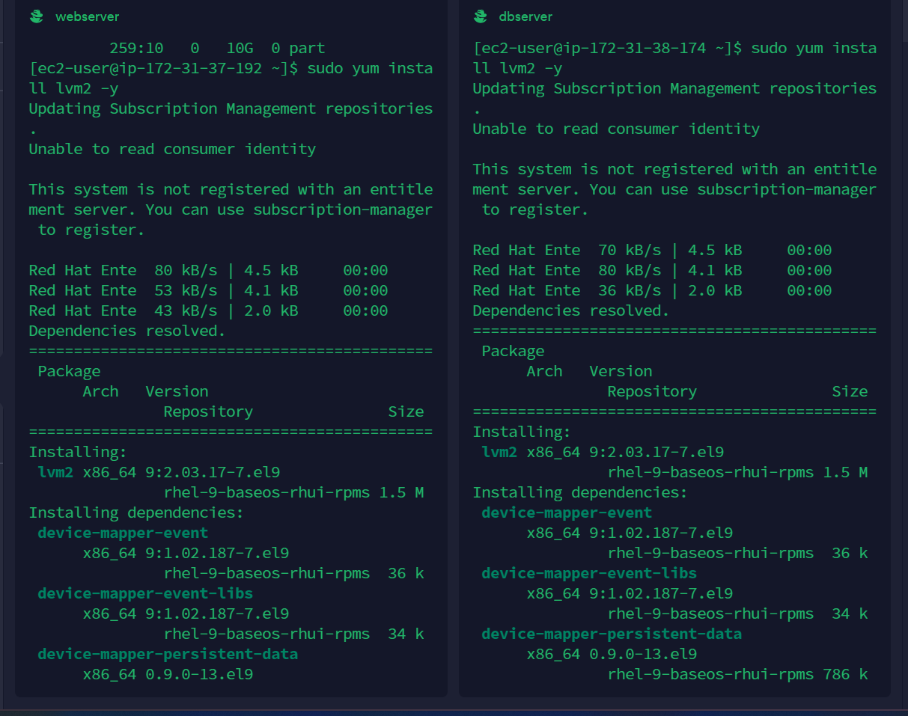

IMPLEMENTING WORDPESS WEBSITE WITH LVM STORAGE MANAGEMENT

This project is tailored to show you how to build and manage a scalable WordPress website using AWS EC2 and LVM(Logical Volume Management) storage

We will be working with a 3-tier setup; a laptop to serve as client, an EC2 instance Linux Server as a web server(this is where you will install WordPress), and an EC2 Linux server as a database server. we will be using `RedHat` OS for this project

PS; I WILL BE WORKING ON MY BOTH SERVERS AT THE SAME TIME

STEP A- IMPLEMENTING LVM ON LINUX SERVERS

`1` Launch an EC2 instance that will serve as 'Web server' and 'DBserver'. create 3 volumes each in the same AZ as your web server and dbserver EC2, each of 10GiB

`2` Attach all six volumes one by one to your 2 instances

`3` Open your terminal and use the `lsblk` command to inspect what block devices are attached to the server. Use `sudo gdisk /dev/xvdf` utility to create a single partition on each of the 6 disks

`4` Use lsblk utility to view the newly configures partition on each of the disks

`5` Use `sudo yum install lvm2` to install lvm2

`6` Use pvcreate utility to mark each of the disks as physical volume to be used by LVM `sudo pvcreate /dev/nvme1n1p1`
`sudo pvcreate /dev/nvme2n1p1`
`sudo pvcreate /dev/nvme3n1p1` Verify that your physical volume has been created successfully by running `sudo pvs`

`7` Use `vgcreate` utility to add all PVs to a volume group `sudo vgcreate vg-webdata /dev/nvme1n1p1 /dev/nvme2n1p1 /dev/nvme3n1p1`

`8` Use `lvcreate` utility to create 2 logical volumes `apps-lv` (use half of the PV size), and `logs-lv` Use the remaining space of the PV size. Note:apps-lv will be used to store data for the website while logs-lv will be used to store data for logs

`sudo lvcreate -n apps-lv -L 14G vg-webdata`
`sudo lvcreate -n logs-lv -L 14G vg-webdata`

`9` Verify the entire setup. run the command `sudo vgdisplay -v #view complete setup - VG, PV, and LV`

`10` Use `mkfs.ext4` to format the logical volumes with ext4 filesystem

`sudo mkfs -t ext4 /dev/vg-webdata/apps-lv`
`sudo mkfs -t ext4 /dev/vg-webdata/logs-lv`

`11` Create /var/www/html directory to store website files

`sudo mkdir -p /var/www/html`

`12` Create /home/recovery/logs to store backup of log data

`sudo mkdir -p /home/recovery/logs`

`13` Mount /var/www/html on `apps-lv` logical volume

`sudo mount /dev/vg-webdata/apps-lv /var/www/html/`

`14` Use `rsync` utility to backup all the files in the log directory /var/log into /home/recovery/logs (This step is required before mounting the file system)

`sudo rsync -av /var/log/. /home/recovery/logs/`

`15` Mount /var/log on logs-lv logical volume `sudo mount /dev/vg-webdata/logs-lv /var/log`

`16` Restore log files back into /var/log directory

`sudo rsync -av /home/recovery/logs/log/. /var/log`

`17` Update `/etc/fstab` file so that the mount configuration will persist after restart of the server. run `sudo blkid` copy the uuid, run `sudo vi /etc/fstab` and update

`18` Test the configuration and reload the daemon. Use command `sudo mount -a` and `sudo systemctl daemon-reload`

`19` Verify your setup by running `df-h`

STEP B- INSTALLING WORDPRESS AND CONFIGURING TO USE MYSQL DATABASE

PREPARE THE DATABASE

Remember, earlier in the project we already started preparing our database.We stopped after we installed lvm. next we use `pvcreate` utility to mark each of the disks as physical volume to be used by LVM `sudo pvcreate /dev/nvme1n1p1`
`sudo pvcreate /dev/nvme2n1p1`
`sudo pvcreate /dev/nvme3n1p1` Verify that your physical volume has been created successfully by running `sudo pvs`

`2` Use `vgcreate` utility to add all PVs to a volume group `sudo vgcreate vg-database /dev/nvme1n1p1 /dev/nvme2n1p1 /dev/nvme3n1p1`

`3` Use `lvcreate` utility to create logical volume `db-lv` `sudo lvcreate -n db-lv -L 14G vg-database`

 `4` Mount /dev/vg-database/db-lv on /dv  `sudo mount /dev/vg-database/db-lv /db` Use df-h to see your setup. use command `blkid` to get your UUID. 

 

 `5` Use command `sudo vi /etc.fstab` to edit in your UUID

 

 `6` Test the configuration and reload the daemon. Use command `sudo mount -a` and `sudo systemctl daemon-reload` and update

 

STEP C- INSTALL WORDPRESS ON WEBSERVER

`1` Install wget Apache and its dependencies. Use the comman `sudo yum -y install wget httpd php php-mysqldnd php-fpm php-json`

`2` Use the command below to enable and start apache `sudo systemctl enable httpd`
`sudo systemctl start httpd`

`3` To install PHP and its dependencies, use the commands below

`sudo yum install https://dl.fedoraproject.org/pub/epel/epel-release-latest-8.noarch.rpm`

`sudo yum install yum-utils http://rpms.remirepo.net/enterprise/remi-release-8.rpm`

`sudo yum module list php`

`sudo yum module reset php`

`sudo yum module enable php:remi-7.4`

`sudo yum install php php-opcache php-gd php-curl php-mysqlnd`

`sudo systemctl start php-fpm`

`sudo systemctl enable php-fpm`

`sudo setsebool -P httpd_execmem 1`

`4` Download wordpress and copy wordpress to /var/www/html Use the commands below

`mkdir wordpress`

`cd   wordpress`

`sudo wget http://wordpress.org/latest.tar.gz`

`sudo tar xzvf latest.tar.gz`

`sudo rm -rf latest.tar.gz`

`cp wordpress/wp-config-sample.php wordpress/wp-config.php`

`cp -R wordpress /var/www/html/`

Start and enable mysqld on your servers

STEP D- CONFIGURE DB TO WORK WITH WORDPRESS

`sudo mysql`

`CREATE DATABASE wordpress;`

`CREATE USER 'myuser'@'<Web-Server-Private-IP-Address>' IDENTIFIED BY 'mypass';`

`GRANT ALL ON wordpress.* TO 'myuser'@'<Web-Server-Private-IP-Address>';`

`FLUSH PRIVILEGES;`

`SHOW DATABASES;`

`exit`

STEP E- CONFIGURE WORDPRESS TO CONNECT TO REMOTE DATABASE

Do not forget to open MYSQL port 3306 on DB Server EC2. For extra security, you shall allow access to the DB Server only from your Web Servers IP address, so in th inbound rule configuration, specify source as /32

`1` Use `sudo vi wp-config.php ` to edit in your details

`2` Test that you can connect from your webserver to your DB server. Verify if you can successfully execute `SHOW DATABASES;` command and see a list of existing databases.

`3` Change permissions and configuration so Apache could use wordpress

`4` Enable TCP port 80 in inbound rules configuration for your web server EC2. Now try to access from your browser your webserver public IP. You should see the image as below;

---------------------------------------------------THANK YOU FOR WATCHING-------------------------------------------